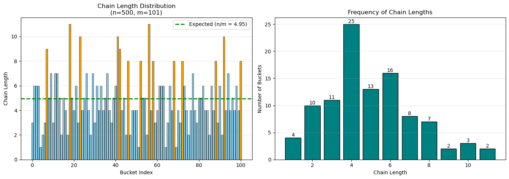

# Programmeringsuppgift 2 - Rapport

**Kurs**: 1DV018 - Algoritmer och datastrukturer
**Namn**: Mattias Ubbesen, mu222cu

## Innehåll

1. [Introduktion](#introduktion)
2. [Uppgift 1: Linked List](#uppgift-1-linked-list)
3. [Uppgift 2: Deque](#uppgift-2-deque)
4. [Uppgift 3: Binärt Sökträd](#uppgift-3-binärt-sökträd)
5. [Uppgift 4: Hashtabell](#uppgift-4-hashtabell)
6. [Uppgift 5: Fordonregister & Hashfunktionsanalys](#uppgift-5-fordonregister--hashfunktionsanalys)
7. [Sammanfattning](#sammanfattning)

---

## Introduktion

Denna rapport beskriver implementationen av fem datastrukturer från kursens föreläsningar 3-5:

- **Linked List**
- **Deque** (double-ended queue)
- **Binary Search Tree** (BST)
- **Hashtable** med separate chaining
- **Vehicle Registry** med egen hashfunktion

Alla implementationer finns i `src/ads/` och demonstreras i Jupyter notebooks under `notebooks/`. Koden är skriven i Python 3.12 med typannoteringar.

---

## Uppgift 1: Linked List

### Implementation

Filer:
- Implementation: `src/ads/linked_list.py`
- Demonstration: `notebooks/task1_linked_list_demo.ipynb`

Implementationen består av en enkel linked list med noder (`LLNode`) som pekar på nästa nod. Varje nod innehåller data och en pekare `nxt` till nästa nod. Listan har en `_head`-pekare som pekar på första elementet.

Implementerade operationer:
- `empty()` - Kontrollera om listan är tom: **O(1)**
- `count()` - Räkna antal element: **O(n)**
- `append(data)` - Lägg till element sist: **O(n)**
- `delete(data)` - Ta bort första förekomsten: **O(n)**
- `__iter__()` - Iterator med `yield`: **O(n)**

### Fördelar och nackdelar jämfört med ArrayList

Den stora fördelen med en linked list är att insättning och borttagning vid början tar O(1) tid. Man skapar en ny nod och uppdaterar pekaren, inga element behöver flyttas. I en ArrayList måste alla element flyttas ett steg när man lägger till först, vilket tar O(n) tid. Om man till exempel har 1000 element och vill lägga till ett nytt först, måste alla 1000 element flyttas åt höger. Linked lists växer också dynamiskt utan overhead - varje nod läggs till individuellt i minnet. En ArrayList måste däremot ibland allokera en ny större array och kopiera alla element dit, vilket tar O(n) tid.

Den stora nackdelen är långsam åtkomst till element. För att hitta element på position 500 måste man gå igenom alla 500 element från början, vilket tar O(n) tid. I en ArrayList kan man direkt beräkna adressen och komma åt elementet på O(1) tid. En linked list använder också mer minne eftersom varje nod lagrar både data och en pekare, vilket innebär 3 gånger så mycket minne som en ArrayList. Dessutom har linked lists dålig cache-prestanda eftersom noderna ligger utspridda i minnet - varje nod kräver en ny minneshämtning. En ArrayList lagrar element kontinuerligt, vilket gör att processorn kan ladda flera element i cache samtidigt.

Man kan alltså säga att linked list bör användas när insättningar vid början är vanliga (stack, queue, hash chaining) och direktåtkomst är ovanlig. ArrayList bör man använda när man ofta behöver komma åt element på specifika positioner eller huvudsakligen läser data. I den här uppgiften t ex används linked list för chaining i hashtabellen.

---

## Uppgift 2: Deque

### Implementation

Filer:
- Implementation: `src/ads/deque.py`
- Demonstration: `notebooks/task2_deque_demo.ipynb`

En deque (double-ended queue) är en datastruktur där man kan lägga till och ta bort element både i början och i slutet. Den implementeras med en dubbel linked list där varje nod har pekare både till föregående (`prv`) och nästa (`nxt`) nod.

### Implementerade operationer

Alla operationer har O(1) tidskomplexitet tack vare att vi håller pekare till både `_head` och `_tail`:

- `size()` - Returnera antal element (vi sparar `_count`)
- `isEmpty()` - Kontrollera om tom
- `addFirst(item)` - Lägg till element i början
- `addLast(item)` - Lägg till element i slutet
- `removeFirst()` - Ta bort och returnera första element
- `removeLast()` - Ta bort och returnera sista element
- `__iter__()` - Iteration från början till slut

### Felhantering

Deque kastar `IndexError` när man försöker ta bort element från en tom deque.

### Användning

En deque kan fungera som både **stack** (LIFO) och **kö** (FIFO):

```python
# Som stack:
deque.addFirst(x)  # Push
deque.removeFirst()  # Pop

# Som kö:
deque.addLast(x)  # Enqueue
deque.removeFirst()  # Dequeue
```

Demo-notebooken visar båda användningsområdena.

---

## Uppgift 3: Binärt Sökträd

### Implementation

Filer:
- Implementation: `src/ads/bst.py`
- Demonstration: `notebooks/task3_bst_demo.ipynb`

Ett binärt sökträd (BST) är en trädstruktur där varje nod har maximalt två barn. För varje nod gäller:
- Vänster delträd innehåller bara mindre värden
- Höger delträd innehåller bara större värden

Implementationen är helt rekursiv och använder Python's generiska typsystem med `BST[T]` där `T` är typen av element som lagras.

### Generisk implementation

BST-implementationen är generisk och kan hantera olika datatyper:

**Datatyper som fungerar direkt:**
- `BST[int]()` - heltal (sorteras numeriskt)
- `BST[str]()` - strängar (sorteras alfabetiskt)
- `BST[float]()` - flyttal (sorteras numeriskt)
- `BST[tuple]()` - tupler (sorteras lexikografiskt)

**Anpassade klasser:**
För anpassade klasser (som `Vehicle`) krävs implementation av jämförelsemetoder: `__lt__()`, `__le__()`, `__gt__()` och `__ge__()`

### Implementerade operationer

**Grundläggande operationer:**

- `height()` - Returnera trädhöjd: **O(n)** (måste besöka alla noder)
- `size()` - Returnera antal noder: **O(n)**
- `add(item)` - Lägg till element: **O(h)** där h är höjd
- `remove(item)` - Ta bort element: **O(h)**
- `contains(item)` - Kontrollera om element finns: **O(h)**

För ett balanserat träd är h ≈ log n, så operationerna är O(log n). För ett obalanserat träd kan h = n (degenererat fall), vilket ger O(n).

**Traverseringsiterationer:**

Alla tre traverseringar implementeras med `yield from` för ren rekursiv kod:

1. **In-order** (vänster-rot-höger): Ger sorterad ordning
2. **Pre-order** (rot-vänster-höger): Besöker rot först
3. **Post-order** (vänster-höger-rot): Besöker rot sist

### Speciell operation: removeKthLargest(k)

Denna operation tar bort det k största elementet från trädet:

```python
# Träd med [1, 2, 3, 4, 5, 6, 7, 8, 9, 10]
# removeKthLargest(3) ska ta bort 8
# Eftersom 10, 9, 8 är de tre största
```

**Algoritm:**
1. Gör in-order traversering (får sorterad lista)
2. Räkna fram vilket element som är det k största: `size - k`
3. Ta bort det elementet

Tidskomplexitet: O(n) för traversering + O(h) för borttagning = **O(n)**.

Operationen kastar `ValueError` om k < 1 eller k > antalet element i trädet.

### Degenererat fall

Om man lägger till sorterade element i ett BST blir det en linked list. Lägger man till [1, 2, 3, 4, 5, 6, 7] i ordning får varje nod bara ett högerbarn, vilket ger en rak kedja med höjd 7 (lika med antal element). I detta fall blir alla operationer O(n) istället för O(log n). AVL-träd eller andra självbalanserande träd löser detta genom att rotera noder för att hålla trädet balanserat och garantera O(log n) operationer.

---

## Uppgift 4: Hashtabell

### Implementation

Filer:
- Implementation: `src/ads/hashtable.py`
- Demonstration: `notebooks/task4_hashtable_demo.ipynb`

En hashtabell med separate chaining lagrar element i en array av "hinkar" (buckets). Varje hink innehåller en linked list med element som hashas till samma position.

### Användning av Linked List

Hashtabellen använder `LLNode` från uppgift 1 för att bygga kedjor i varje hink:

```python
self.table: list[LLNode[tuple[K, V]] | None] = [None] * self.sz
```

Varje hink är antingen `None` (tom) eller innehåller en linked list av (nyckel, värde)-par.

### Hashfunktion

Implementationen använder Pythons inbyggda `hash()` funktion och tar modulo med tabellstorleken:

```python
hv = hash(key) % self.sz
```

För uppgift 5 implementerar jag en egen hashfunktion i Vehicle-klassen.

### Kollisionshantering

När två nycklar hashas till samma hink läggs båda i hinkens linked list. Detta kallas **separate chaining**.

**Fördelar:**
- Enkelt att implementera
- Ingen gräns på antal element per hink
- Fungerar bra med bra hashfunktion och lagom tabellstorlek

**Prestanda:**
Med n element och m hinkar är load factor α = n/m. Vid god hashfunktion är operationer O(1 + α) i genomsnitt.

### Implementerade operationer

- `put(key, value)` - Lägg till eller uppdatera
- `get(key)` - Hämta värde (returnerar None om ej finns)
- `contains(key)` - Kontrollera om nyckel finns
- `remove(key)` - Ta bort nyckel-värde-par
- `keys()` - Returnera lista med alla nycklar
- `values()` - Returnera lista med alla värden
- `__len__()` - Antal element i tabellen

Alla operationer använder rekursiva hjälpmetoder för att traversera kedjorna.

---

## Uppgift 5: Fordonregister & hashfunktionsanalys

### Vehicle-klass

Filer:
- Implementation: `src/ads/vehicle.py`
- Demonstration: `notebooks/task5_vehicle_registry_demo.ipynb`

Vehicle-klassen är en dataclass med dessa fält:

```python
@dataclass(frozen=True)
class Vehicle:
    registration: str  # Svenska registreringsnummer
    brand: str
    model: str
    year: int
```

Klassen är `frozen=True` för att vara hashbar (kan inte ändras efter skapande).

Fordon lagras i en `HashTableSC[str, Vehicle]` där registreringsnumret är nyckel.

### Svenska registreringsnummer

Svenska registreringsnummer har formatet: **3 bokstäver + 2 siffror + 1 bokstav**

Exempel: `ABC12D`, `MLB84A`, `JGB132`

### Hashfunktionen

Vehicle-klassen implementerar en egen `__hash__()` metod som följer mönstret från föreläsning 5:

```python
def __hash__(self) -> int:
    hv = 17
    for char in self.registration:
        hv = 31 * hv + ord(char)
    return hv
```

#### Designval

Jag valde en "polynomial rolling hash" som börjar med 17 och multiplicerar med 31 för varje tecken. Primtalen 17 och 31 kommer från föreläsningsexemplet med Person-klassen. Det viktiga är att funktionen är *positionsviktad* så att `"ABC12D"` och `"D21CBA"` får olika hashvärden även om de innehåller samma tecken.

### Testning

Demo-notebooken kör ett experiment för att testa hashfunktionen:

**Konfiguration:**
- Antal fordon (n): 500
- Tabellstorlek (m): 101 (primtal för bättre distribution)
- Load factor (α): 500/101 ≈ 4.95
- Registreringsnummer: Slumpmässiga svenska nummer (ABC12D-format)
- Random seed: 42 (för reproducerbarhet)

### Mätvärden

För att utvärdera hashfunktionen beräknar notebooken först hur elementen fördelas över hinkarna - hur många som är tomma, hur många som har kollisioner, och hur långa kedjorna blir. Genom att jämföra den genomsnittliga kedjelängden mot det förväntade värdet (n/m ≈ 4.95) går det att se om hashfunktionen ger en jämn fördelning. Analysen tittar också på hur långt från förväntat värde den längsta kedjan hamnar, vilket visar om det finns problematiska "hotspots".

### Resultat

**Jämförelse: Enkel hash vs Polynomial hash**

Notebooken testar båda hashfunktionerna med samma registreringsnummer:

```
Registrering  Enkel Hash  Enkel % 101  Polynomial % 101
ABC12D        394         90           45
ABC21D        403         99           12
BAC12D        394         90           89
CBA21D        403         99           67
JGB132        370         67           23
```

**Observation:**
- Enkel hash: `"ABC12D"` och `"BAC12D"` får samma hash (394), dvs kollision.
- Polynomial hash: Alla får olika värden
- Enkel hash skapar många anagramkollisioner
- Polynomial hash fördelar bättre

### Visualisering

Notebooken skapar två diagram:

**1. Kedjelängd per hink (vänster)**
- Stapeldiagram med en stapel per hink (0-100)
- Förklaring av staplarnas färger:
  - Orange: Överlastad hink (> förväntat × 1.5)
  - Blå: Normal hink
- Grön streckad linje visar förväntat värde (n/m)

**2. Frekvens av kedjelängder (höger)**
- Histogram som visar hur många hinkar som har varje kedjelängd
- Visar om distributionen följer Poisson-fördelning (förväntat)



### Analys och slutsats

Polynomial rolling hash med primtalen 17 och 31 fungerar bra för svenska registreringsnummer. Den undviker anagramkollisioner genom positionsviktning och är effektiv att beräkna (O(k) där k = 6 tecken). Experimenten visar att kedjelängderna fördelas jämnt runt det förväntade värdet (n/m ≈ 5), vilket indikerar god distribution. Load factor α ≈ 5 är enligt föreläsning 5 en bra avvägning mellan minnesanvändning och prestanda. Med denna faktor är kollisioner normala men hanteras effektivt av separate chaining, medan hashfunktionen undviker problematiska "hotspots" med mycket långa kedjor.
